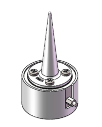
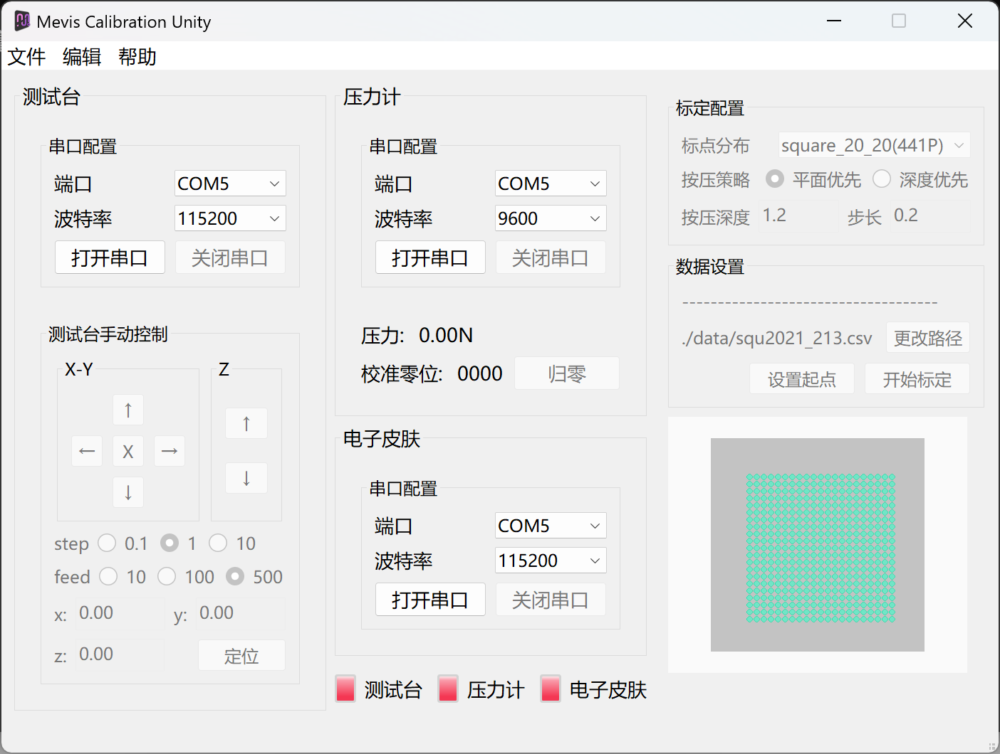

# MERCI Project

Say Merci!!!

ultralyj的毕设，

looking for the magic of magnet,

say merci to graduate,

------------------------------

项目目前包含：

- [x] 嵌入式代码（基于stm32f4）
- [x] 硬件PCB（包含`F4V3`，`Finger`两款）

  F4V3是30mm试验型磁触觉电子皮肤

  Fringer是安装在AG-145夹爪上的传感器，MCU分体，FPC连接的微型磁触觉电子皮肤

- [x] 3D模型（包含F4V3的模具，压力计外壳，标定用的压头等）

- [x] 传感器网络（目前使用MLP搭建）
- [x] 标定一体化界面（Qt构建，统一管理标定测试台，压力计与电子皮肤，实现电子皮肤标定无人化）
- [x] 电子皮肤上位机（Electrion+React+AntD构建，简明，优美的图形化GUI，包含安装包）
- [x] Comsol磁场仿真模型（对磁化过程进行了简单仿真）

  

